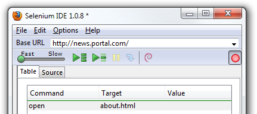
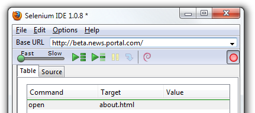

Selenium IDE 窗口顶部的 Base URL 字段对于测试用例运行在不同域时非常有用。假设一个名为 http://news.portal.com 的网站有一个名为 http://beta.news.portal.com 的内部测试网站。针对这些网站的任何测试用例，都是以 open 命令开始的，open 命令指定一个相对 URL 路径作为参数，而不是绝对 URL 路径（绝对路径是从一个协议，比如 http: 或 https: 开始的）。Selenium IDE 通过将 open 命令的参数追加到 Base URL 后面，来创建一个绝对的 URL 路径。例如，下面的测试用例将会运行在 http://news.portal.com/about.html：

同样的测试案例修改一下 Base URL 设置就可以运行在 http://beta.news.portal.com/about.html：

